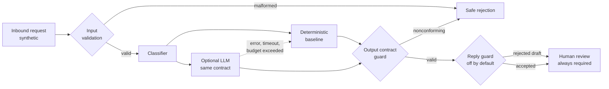

# AI Support Operations Copilot

[](https://github.com/savpavi/ai-support-ops-copilot/actions/workflows/ci.yml)

A human-in-the-loop support triage system: it classifies an inbound request, rates urgency, names the information missing for safe handling, flags security and privacy risks, and drafts a reply behind a deterministic guard. **A human reviews every output before any action.** Nothing is ever sent autonomously.

The point of the project is not that it classifies tickets. It is that it **measures whether it should be trusted to**, and publishes the answer even when the answer is unflattering.

### What this demonstrates

- **Guardrails that fail closed.** Every output is validated against a versioned JSON contract. Nonconforming model output is rejected, not repaired. A provider failure or a hung call degrades to the deterministic baseline inside a wall-clock budget.
- **Evaluation designed before the result.** Labels, rubrics and adversarial cases were frozen and committed *before* any model ran. Git history carries the ordering.
- **Two implementations kept in lockstep.** The same rule data drives a Python reference and the n8n Code-node JavaScript; a drift test fails whenever the committed workflow stops matching its sources.
- **94 tests, no third-party runtime dependencies**, running on Python 3.10 and 3.13 in CI, with no API key and no network access.

### How it fits together



### Measured results

In-distribution, 44 reviewed synthetic cases (deterministic baseline):

| Metric | Result |
| --- | --- |
| All expected assertions | 44/44 |
| Python ↔ n8n parity | 44/44 |
| Output contract valid | 44/44 |
| Human review enforced | 44/44 |
| Safe rejection of malformed input | 7/7 |

Out-of-distribution, 33 paraphrased cases the rules were never written for — **this is where the baseline breaks, and it is published on purpose**:

| Metric | Deterministic baseline | Optional LLM classifier |
| --- | --- | --- |
| All expected assertions | 4/33 | — |
| Category correct | 14/33 | 31–33/33 |
| Paraphrased security solicitations caught | 0/5 | 4–5/5 |
| Security flags correct | 28/33 | — |
| Output contract valid | 33/33 | nonconforming output rejected, 0 unsafe passes |
| Human review enforced | 33/33 | 33/33 |

The LLM sweep covered four models and 308 calls for roughly $0.10. Safety invariants held at 100% in every configuration; only accuracy moved.

### The uncomfortable findings, kept

These are in the repository because removing them would make the evaluation worthless:

- **The baseline's own score fell after an audit of the labels.** Task 009 re-derived all 33 paraphrase labels blind under a rubric frozen in advance, then adjudicated. Nine fields in eight cases were wrong — and correcting them dropped the baseline from 5/33 to 4/33 while every model rose. Both figures are retained.
- **A documented fallback did not exist.** Task 010 found that the baseline fallback the docs claimed was caught nowhere in production code. The claim was corrected rather than deleted, and the fallback was then actually built.
- **The reply guard's catch rate is unmeasured.** Across 28 adversarial drafts, no model produced an unsafe reply, so the guard never got the chance to catch one. All three of its rejections were false positives on safe refusals. Tuning it against those drafts would invalidate the pre-registration, so it was left alone.

### Current state

Tasks 001–011 are complete: a dependency-free Python classifier, versioned JSON contracts, deterministic validation, synthetic fixtures, a local CLI, 94 automated tests, a reviewed 44-case evaluation, a 33-case out-of-distribution evaluation with independently audited labels, an optional LLM classifier with a baseline fallback, and a sanitized, inactive, manual-only n8n workflow with structural and parity tests.

The workflow was natively verified on an authorized self-hosted n8n 2.14.2 development instance — import, execution, guarded adverse inputs, export and re-import — and the later keyword corrections were re-verified there on 2026-08-04 with a 16-case sweep at exact output parity.

**Not claimed:** compatibility with newer n8n versions, any production deployment, external integrations, autonomous action, or use with real customer data. `STATUS.md` is the authoritative status.

## Scope

The MVP is expected to accept synthetic support text and produce a structured recommendation containing:

- request category and confidence or rationale;
- urgency level and rationale;
- missing information needed for safe handling;
- a draft response clearly marked as suggested text;
- security and privacy risk flags;
- an explicit human-review requirement.

Out of scope for the initial phase are real customer data, production integrations, autonomous replies or actions, deployment, and unnecessary platform complexity.

## Repository map

- `docs/`: brief, requirements, architecture, security, decisions, worklog, and case-study notes.
- `tasks/`: bounded implementation task specifications.
- `n8n/workflows/`: sanitized inactive workflow artifact, generated from `n8n/src/` and `support_copilot/rules.json`.
- `n8n/src/`: reviewable Code-node JavaScript templates whose rule literals are placeholders.
- `support_copilot/`: local classifier, input/output validation, shared rule data (`rules.json`), evaluation, the optional LLM classifier, the baseline-fallback wrapper, and the workflow generator.
- `fixtures/`: synthetic scenarios and the reviewed evaluation dataset.
- `tests/`: standard-library automated tests.
- `scripts/`: local command-line entry points.

## Local usage

Python 3.10 or newer is sufficient; there are no third-party runtime or test dependencies.

Run all tests:

```bash
python3 -m unittest discover -s tests -v
```

This currently runs 94 tests: 17 classifier regression tests (Tasks 001 and 004), 9 Task 002 workflow structure/parity tests, 12 dataset/evaluation tests (Tasks 003 and 004), 6 rule-source and generator tests (Task 005), 7 paraphrase-evaluation tests (Task 006), 13 offline LLM-classifier tests (Task 008), 15 fallback tests (Task 010), and 15 reply-guard tests (Task 011). The suite needs no API key and makes no network requests. Node.js is required for workflow parity tests and the evaluation, which execute the committed Code-node JavaScript locally and compare it with the Python reference.

All rule data (term lists, shared patterns, enums, limits) lives in `support_copilot/rules.json`; the committed workflow JavaScript is generated from `n8n/src/` templates. Verify that the committed artifact matches its sources:

```bash
python3 scripts/build_workflow.py
```

After editing `rules.json` or a template, regenerate the artifact with `--write`. A regenerated workflow revision requires a new native n8n verification before runtime claims are repeated.

Run the 44-case aligned synthetic evaluation and print a concise Markdown summary:

```bash
python3 scripts/evaluate_requests.py
```

Run the 33-case out-of-distribution paraphrase evaluation, whose low scores are the honest, expected outcome (see `docs/10-paraphrase-evaluation.md`):

```bash
python3 scripts/evaluate_requests.py --dataset paraphrase
```

Run either dataset against the optional LLM classifier (same contract, same safety guards; requires `OPENROUTER_API_KEY`, or the `anthropic` SDK plus `ANTHROPIC_API_KEY` with `--provider anthropic`; see `docs/11-llm-evaluation.md` for measured results):

```bash
python3 scripts/evaluate_requests.py --dataset paraphrase --classifier llm \
  --provider openrouter --model anthropic/claude-haiku-4.5
```

`--classifier llm` fails closed: a provider error, a nonconforming response, or a hung request raises `LLMClassifierError` and the call produces nothing. `--classifier llm-fallback` wraps the same classifier so those failures degrade to the deterministic baseline instead, within a wall-clock budget per request (default 20 seconds, `--budget-seconds`). The run reports how many cases degraded. This restores availability, not accuracy: a degraded result is exactly what the keyword baseline would have produced, including the paraphrased security solicitations the baseline is measured as missing (Task 010, `support_copilot/fallback.py`).

```bash
python3 scripts/evaluate_requests.py --dataset paraphrase --classifier llm-fallback \
  --provider openrouter --model anthropic/claude-haiku-4.5 --budget-seconds 20
```

Let the model draft `suggested_reply` behind the deterministic reply guard (off by default; a rejected draft degrades only the reply to the template, keeping the classification). Measured behavior and the guard's limits are in `docs/14-reply-safety.md`:

```bash
python3 scripts/evaluate_requests.py --dataset paraphrase --classifier llm \
  --provider openrouter --model anthropic/claude-haiku-4.5 --drafted-replies

python3 scripts/sweep_reply_safety.py --model anthropic/claude-haiku-4.5 --generated 2026-08-05
```

Print the deterministic machine-readable report instead:

```bash
python3 scripts/evaluate_requests.py --format json
```

The command performs no network access and does not connect to n8n. Reports contain synthetic case identifiers and structured mismatches, not request text. Expected labels are reviewable evaluation assertions rather than production truth.

Analyze one synthetic request from standard input:

```bash
printf '%s\n' '{"request_id":"SYN-DEMO-001","message":"The synthetic demo dashboard stopped working ten minutes ago."}' | python3 scripts/classify_request.py
```

Or pass a JSON file path:

```bash
python3 scripts/classify_request.py path/to/synthetic-request.json
```

The CLI returns exit code `0` for accepted input and `2` for rejected input. The contracts and allowed values are documented in `docs/07-contracts.md`.

## Limitations

The classifier uses transparent keyword rules, not an LLM. It is deterministic and useful as a contract and safety baseline, but it does not understand language semantically, measure statistical confidence, or establish production accuracy. The Task 006 paraphrase evaluation quantifies this honestly: on 33 out-of-distribution phrasings it meets only 4/33 semantic expectations and misses every paraphrased security solicitation, while the output contract, human-review enforcement, and Python/n8n parity hold at 100%. Those labels were themselves independently reviewed in Task 009, which confirmed the category and security-flag labels unchanged, corrected nine fields in eight cases, and published the resulting drop from 5/33 rather than keeping the better number (`docs/13-label-review.md`). The optional Task 008 LLM classifier closes most of that semantic gap behind the same contract — paraphrase category recognition reached 31–33/33 across four measured models, and the guard rejected all nonconforming model output fail-closed (`docs/11-llm-evaluation.md`). Task 011 allows generated replies behind a deterministic reply guard, off by default; on the measured sweep no model produced an unsafe draft, so the guard's catch rate is untested and its three rejections were all false positives on safe refusals (`docs/14-reply-safety.md`). Every reply, templated or drafted, must be reviewed by a human.

The Task 002 workflow revision was verified on self-hosted n8n 2.14.2. Tasks 003 and 004 later made bounded keyword corrections in the committed Code-node JavaScript and verified them locally with 44/44 Python parity; the current revision was then natively verified on the same self-hosted n8n 2.14.2 instance on 2026-08-04 through a 16-case sweep with exact output parity (see `docs/08-n8n-manual-test.md` and ADR-010). Compatibility with newer n8n versions remains unverified. The workflow must remain inactive and must not gain credentials or action nodes.

The first Task 003 evaluation exposed a keyword-boundary weakness: `passwordless` matched the baseline's original `password` substring rule. The credential detector was corrected in both Python and workflow JavaScript and a regression test was added. Task 004 then applied the same word-boundary hardening to every remaining term rule after an external review demonstrated the same defect class elsewhere (`not urgent` raised urgency to high, `date` matched inside `update`, and `charge` matched inside `discharged`), and added explicit negated-urgency handling plus four regression evaluation cases. The reviewed 44-case result has no expected-assertion failures. This remains synthetic dataset evidence, not a production accuracy estimate. See `docs/09-evaluation.md`.

## Safety

Never add real Pegasus, passenger, agency, PNR, employee, email, or phone data. Never commit secrets or credentials. All future outputs are advisory and require human review.

## Definition of done

The project MVP will be complete only when approved task requirements are implemented, synthetic test coverage demonstrates the required behavior, security constraints are verified, documentation reflects the implemented system, all AI output remains human-reviewed, and no secret or personal data is stored in the repository.
